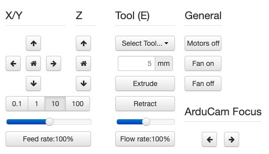

# ArduCamFocus

This plugin controls the focus on an ArduCam Motorized Focus Camera.  https://www.arducam.com/docs/cameras-for-raspberry-pi/motorized-focus-camera/



It uses a custom `@ARDUCAMFOCUSSET FOCUS` command that can be incorporated within your slicer to automatically adjust focus while printing. 
You can also send relative adjustments with `@ARDUCAMFOCUS 50` or `@ARDUCAMFOCUS -50`

Example: `@ARDUCAMFOCUSSET 300` will set the focus to 300.

## Video Example

<video  width="800" height="600" src="extras/assets/img/plugins/ArduCamFocus/ArduCamFocusScreenCap.mov"></video>

## Pre-Installation Requirements

Please follow the manufacturer's instructions:

This plugin uses I2C to communicate with the camera.  That is not enabled by default.  The ArduCamFocus plugin will not function until
you enable I2C.
  ssh to your octopi and enter this commands (this only needs to be done once):
```bash
if ! grep -Fxq "^#ArduCamFocus$" /boot/config.txt; then
sudo cat << end_of_file > /boot/config.txt
#ArduCamFocus
dtparam=i2c_vc=on
dtparam=i2c_arm=on
end_of_file
fi
```
After executing the above command, the file /boot/config.txt should now have the commands to enable I2C.  In addition, you have to enable the I2C
kernel module using raspi-config.  Again, ssh to your octopi, and then enter this command:
```bash
sudo raspi-config
```

1. select "5 Interfacing Options"
2. select "P5 I2C"
  1. raspi-config will ask, "Would you like the ARM I2C interface to be enabled?"
  2. select "<Yes>"
and you should see, "The ARM I2C interface is enabled"
3. select "<Finish>"

After you reboot, the camera should become operational in OctoPrint.
    
### Disclaimer

Although I have used this plugin and it has worked for me without issues, I take no resposiblity for any damage caused by using this plugin. Please make sure to do your reseach and understand the dangers and please be careful.

